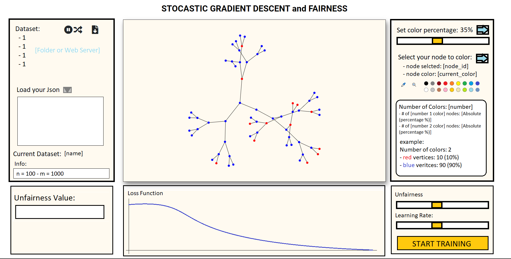

# Progetto Fairness

Esame di Programmazione per Internet e Web
### ToDos: 
- aggiungere un panel per selezionare la percentuale di nodi colorati.
- aggiungere un tool per scegliere esattamente quali nodi colorare (?)
- aggiungere pulsante per re run dell'applicazione

- 
